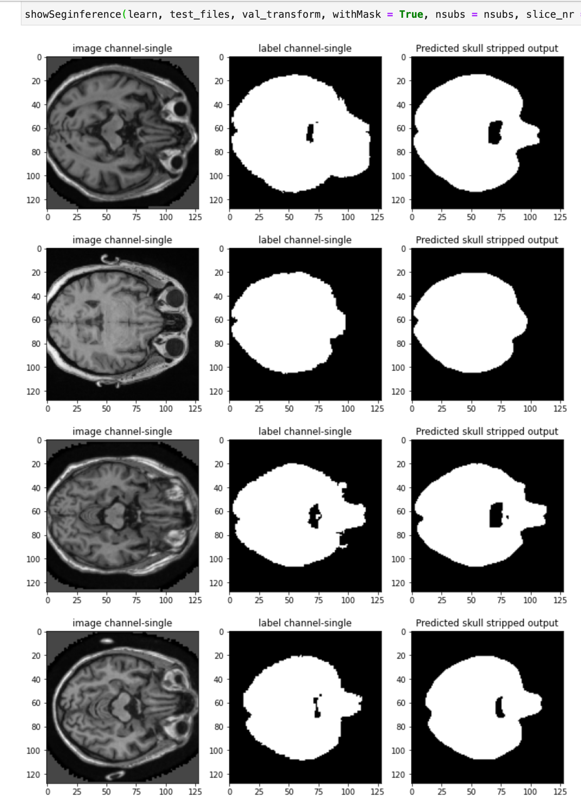
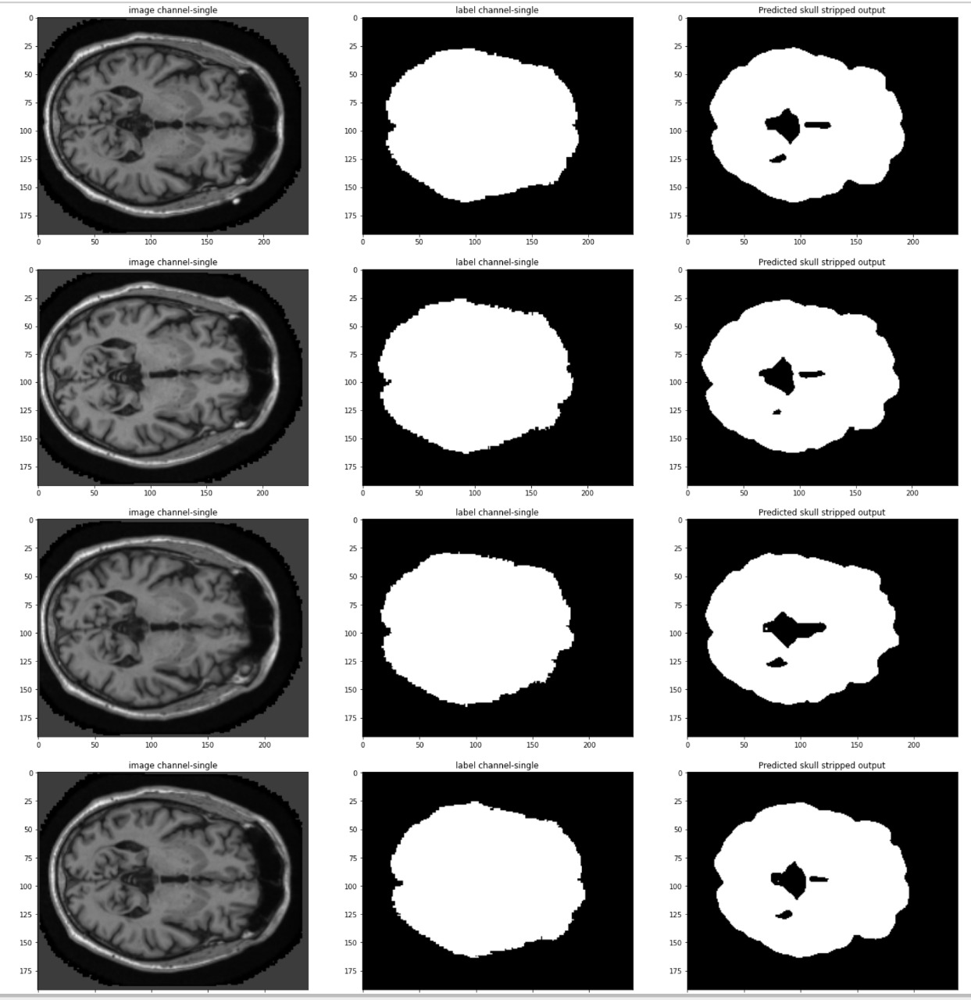

# SkullStripping
The project is about skull stripping of large and heterogenous MRI images using state-of-the-art methods.
We have used fastai2 and monai 3.0 for the project. 

#### To install fastai2(2020) in Anaconda (latest version), we can follow following instructions (in Ubuntu 18.04, may work with other linux kernels, can't guarantee that it will work).

**Creating a virtial conda enviroment by using conda:** <i> `conda create --name fastai2 `</i>

**Activating the virtial conda enviroment by using conda:** <i> `conda activate fastai2 `</i>

**Installing pytorch with cudatoolkit, either using conda:**
<i> `conda install pytorch torchvision cudatoolkit=10.2 -c pytorch ` </i>
**or using pip:**
<em>`pip install torch torchvision ` </em>

**Installing fastai2, either using conda:**
<em>`conda install -c fastai fastai `</em>
  
 **or using pip:** <em> ` pip install fastai `</em>
 
 **Installing jupyterlab using conda:** <i> `conda install -c conda-forge jupyterlab ` </i> 

**for more details, visit https://docs.fast.ai/**

**Installing monai using pip**
<em>` pip install monai`</em>

 The segmentation result is shown below on test set (927 images) while 3D U-Net is used. While doing inference, we have tranformed test images into the validation image space. 

The segmentation result on test set (927 images) is displayed below while 3D nnU-Net is used. We have executed inference on the test image space using sliding window inference. The combination of dice loss and corss entropy loss were used while training.

